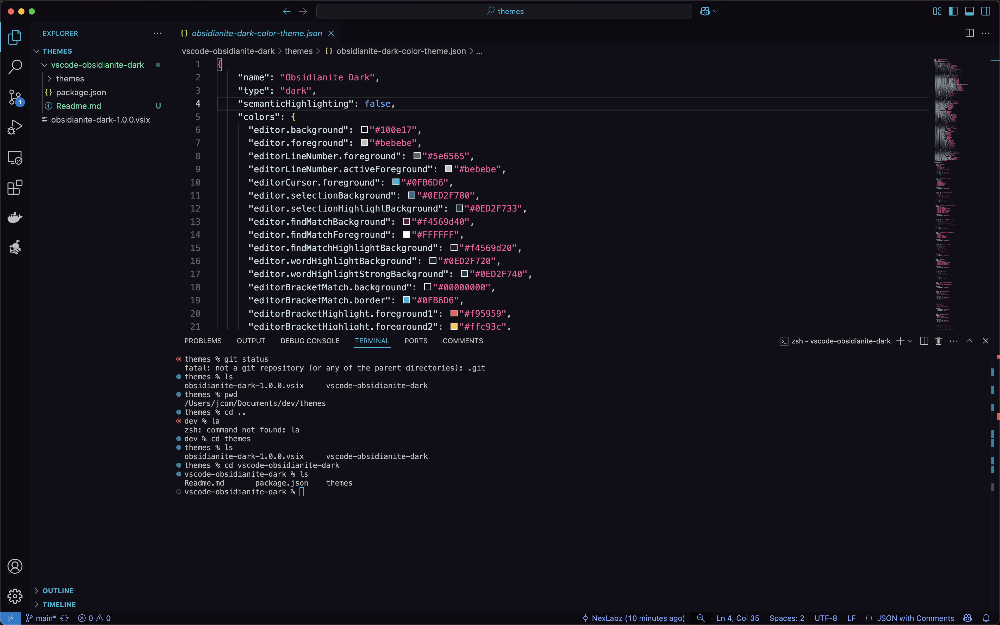
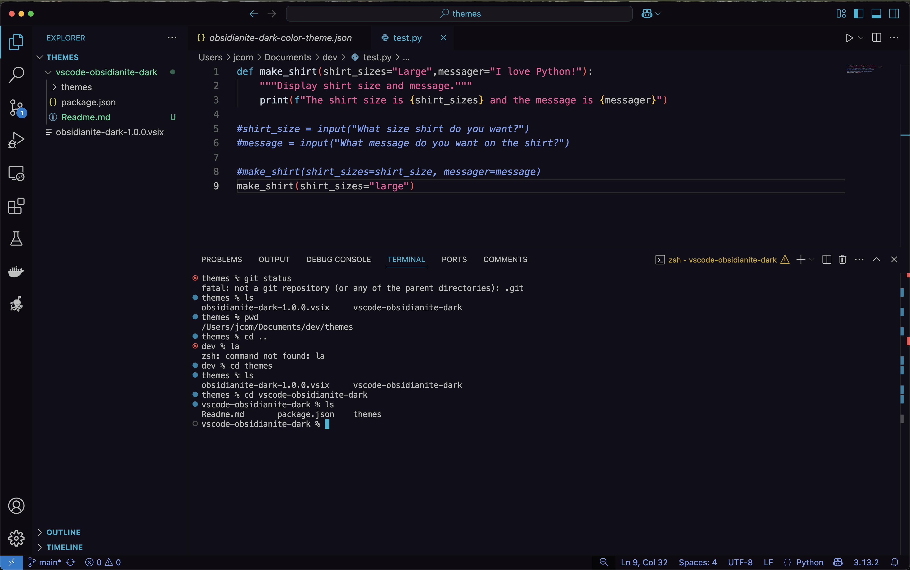

# Obsidianite Dark – VS Code Theme

A dark, neon-inspired Visual Studio Code theme based on the [Obsidianite](https://github.com/bennyxguo/Obsidian-Obsidianite) theme for the Obsidian note-taking app.

I loved the look and feel of Obsidianite so much that I ported its color palette and style into VS Code as a full theme.





---

## 🚀 Installation

### 📦 One-line install (from GitHub Releases)

> Make sure you have the `code` command installed in your terminal ([how to do that](https://code.visualstudio.com/docs/setup/mac#_launching-from-the-command-line)).

```bash
code --install-extension https://github.com/yourusername/vscode-obsidianite-dark/releases/download/v1.0.0/obsidianite-dark-1.0.0.vsix
```

## ✨ Inspiration

This VS Code theme is heavily inspired by the amazing [Obsidianite theme for Obsidian](https://github.com/bennyxguo/Obsidian-Obsidianite) created by [@bennyxguo](https://github.com/bennyxguo).

All credit for the original color palette and aesthetic goes to them. This theme is simply a VS Code adaptation.

## 🧪 Notes

Best enjoyed with the Rubik font or Operator Mono.
Italics and color styles are optimized for that smooth, Obsidianite feel.